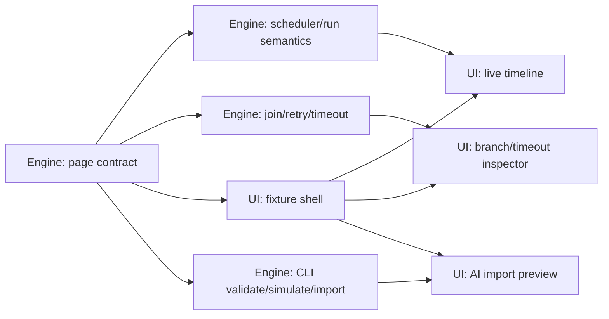

# Parallel Delivery Plan

下一阶段使用两人模式。一个人负责 Engine/Runtime/AI CLI，一个人负责 Product UI/UX。两边可以并行，但必须以合同为边界：Engine 交付 projection/action/fixture，UI 只消费这些合同。

## Phase 0: Page Contract Freeze

必须先完成：

- 本目录的页面模型、AI draft schema、两人边界被接受。
- Workflow visual/UX contract 被接受：Pro macOS 克制风格、拖拽编排、依赖图、运行反馈作为 UI 验收标准。
- 两个 owner 各自写完下一阶段 workstream。
- 列出第一批 ready-for-ui backend capability notices。
- UI owner 拿到 fixture，不依赖 live 后端也能重建页面。

## Phase 1: Backend Semantics And UI Shell In Parallel

| Owner | Can Work In Parallel | Must Not Do |
| --- | --- | --- |
| 1: Engine/Runtime/AI CLI | repeating occurrence、join policy、timeout/retry、resource waiting、visual condition、projection fields、workflow CLI validator/importer | import SwiftUI；决定 UI 布局；让 CLI 写内部 state；不得在本阶段开发 MCP server。 |
| 2: Product UI/UX | Workflow 页面布局、fixture-based graph/timeline/inspector、拖拽/拉线交互模型、Pro macOS 视觉收敛、状态文案、AI draft preview | 在 SwiftUI 里补 reducer 语义；直接调用 repository/player/evaluator；把未 ready-for-ui 的能力当成 live 功能；用 Web 风格高饱和全宽按钮替代原生生产力工具质感。 |

Owner 2 的 Phase 1 输出必须包含 idle、drag/link、running 三个状态的截图或短录屏；只给静止态截图不能算完成。视觉审查优先看普通控件是否退到背景、用户数据是否成为主视觉、拖拽/连线/运行态是否通过原生 affordance 而不是大色块表达。

## Phase 2: Live Wiring

进入此阶段前，Engine owner 必须将目标能力标为 `ready-for-ui`。

- UI owner 将 fixture UI 接 live projection。
- UI owner 所有编辑动作走 accepted action/view intent。
- Engine owner 暴露 import/export/simulate CLI 或 app service。
- 两个 owner 联合跑一个端到端用例：手动启动 -> 条件等待 -> timeout 分支 -> run history/evidence metadata。

## Phase 3: AI Authoring

- 本阶段只做 CLI validator/importer。
- MCP 暂缓；未来如需要，只包装 CLI/shared service。
- UI 的 AI 入口先展示 draft preview、validation warnings、macro resolution choices。
- 导入前必须 simulate，导入后必须能从 UI 删除或回滚。

## Phase 4: Product Hardening

- FlowGraph 大图性能。
- Keyboard navigation 和无拖拽替代操作。
- 多显示器/window/content OCR region 体验。
- 导入缺失宏、宏重名、版本冲突。
- 后台启动、登录项、系统权限提示。

## Dependency Map

## Do Not Parallelize

- 不要同时修改 internal workflow package 和 external AI draft schema。
- 不要在 join policy 的 FlowGraph/Inspector 表达未通过 fixture/截图验收前，把复杂合流 UI 标为完成。
- 不要把 resource waiting first pass 误标为完整队列产品；priority、preemption、starvation 和 cross-process arbitration 还不能做最终交互承诺。
- 本阶段不要做 MCP server。
- 不要在 projection 字段未定时让 UI 读取 reducer 内部数组自行推导。
