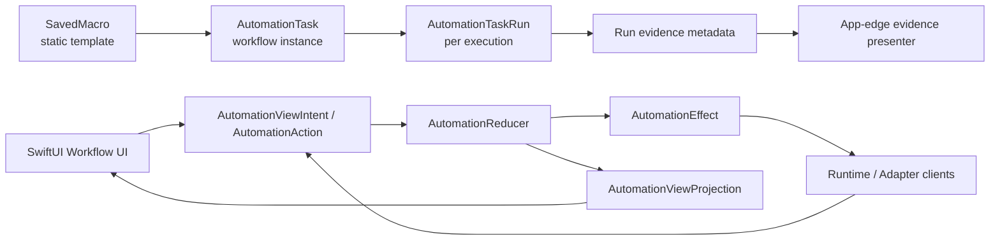

# Owner 2 Workflow UI Current State And Future

更新时间：2026-07-06
状态：暂停交接文档
Owner：Owner 2, Product UI And Workflow UX

本文是 Workflow 页面前端产品化的暂停快照。它记录目前真实架构、前端逻辑、文件结构、已完成 first pass、仍未完成缺口，以及后续设计构想。恢复开发时先读全局暂停快照 `08-current-architecture-and-future.md`，再读本文；`08` 是当前架构和 Owner 1 进度的总口径，本文只补 Owner 2 UI/UX 视角。随后再回到 `00-current-status.md`、`01-page-model-and-user-flow.md`、`06-workflow-visual-ux-contract.md`、`02-backend-frontend-contract.md` 和 `workstreams/product-ui-ux.md`。

重要原则：first pass 不是完成态。只有代码存在、测试/构建通过、文档匹配真实行为，并且有产品体验证据时，才能把 checklist 项目标为 done。

## 1. Snapshot

当前 Workflow 页面已经从“右侧表单配置页”推进成“Pro macOS 原生编排台”的 first-pass 形态。核心骨架已经存在：

- 左侧 workflow list + Macro Library source bin。
- 中央 FlowGraph，可展示节点、边、trigger label、join badge、branch guide，并支持 connector drag linking。
- 下方 Resource Timeline，可展示计划、运行、等待、失败、timeout、retry、resource waiting、condition progress。
- 右侧 Inspector，从唯一创建入口退回到精修入口，提供非拖拽替代路径。
- AI Draft Preview，可 validate、simulate、dry-run、confirm import、rollback/restore、quick-edit、patch、export。
- OCR/visual condition authoring，可编辑 bounds、region/image/baseline refs、pixel color、threshold，并支持 draft package 内 asset registration、external import-copy、baseline capture。
- Task Run Detail 已有 per-run-aware evidence viewer first pass，可读取 macro package 的 `runs/<evidenceID>/manifest.json` / `report.json`，显示 binding status、report-derived diagnostic summary、projection-derived selected-run branch context 和 manifest binding detail，找不到时降级到 matching legacy latest evidence，显示 inline screenshot preview，并在截图预览不可读时保留 report payload。

但它还不能称为产品完成。当前最大缺口不是“还缺几个按钮”，而是可信自动化产品必须具备的证据链和验收证据：

- idle / drag-link / task-reorder / running fixture 截图已补；仍缺真实 drag/reorder 录屏和 live diagnostics 录屏。
- `AutomationTaskRun.conditionEvidence` 真实 payload first pass 已完成，并可带 live last-sample / watched-region artifact refs；失败/拒绝的 OCR/visual condition 现在也会尽量返回解释性 diagnostics payload，能拿到截图时保留 sample/crop artifact refs；visual 截屏成功但 bitmap 解码失败时也保留 captured sample / watched-region crop；`previousOutcome`、external signal、manual approval 也会返回 context-only diagnostics payload，说明 predicate/signal/approval 判定原因；`AutomationConditionEvidenceArtifactPresenter` 已提供安全预览/open/reveal 边界和 action feedback，fixture visual diagnostics drill-in 截图已补，仍缺真实 live capture 录屏和更完整交互验收。
- Runtime branch decision evidence first pass 已由 reducer 写入 `AutomationTaskRun.branchEvidence` 并随 run history 持久化；dependency edge、Inspector branch row 和 selected Run Detail branch context 会优先读 durable payload，再回退到 projection。
- 缺 visual diagnostics 真实 live capture 录屏、Open/Reveal 真实交互录屏和 template/baseline diff polish；Run Detail macro evidence 与 visual artifact 的 Reveal/Open 按钮及 inline feedback 已有 fixture 证明。
- 缺复杂 resource queue 的完整产品表达。
- 缺 managed visual asset storage / migration policy。
- 缺 daemon/background runtime handoff。
- 缺大量节点/连线的性能验收。

本次暂停时，不继续推进无边界 UI 控件；后续恢复开发应先补产品证据、branch evidence drill-in 验收录屏和 visual diagnostics，而不是继续堆按钮。

## 2. Owner 1 Alignment

Owner 2 当前必须跟随 `08-current-architecture-and-future.md` 的进度口径。Owner 1 已经把底座推进到很多 first pass，但 UI 不能把 first pass 当完成态展示；UI 侧要把这些能力转译成用户能理解、能验证、能排查的产品体验。

| Owner 1 / Global State | Owner 2 Alignment | UI Must Not Claim |
| --- | --- | --- |
| Reducer/state machine 已覆盖 manual/scheduled start、dependency、join policy、resource wait、timeout、retry、condition、cancel、panic release。 | Graph、Timeline、Inspector 只读 projection，并把这些状态表达成“正在执行、等待上一步、等待鼠标键盘空闲、超时、重试、条件等待”。 | 不在 SwiftUI 中重写调度、retry、timeout、resource queue 或 dependency resolution。 |
| Resource queue 仍是 first pass。 | UI 可以显示 `resourceWaiting` 的等待原因、blocker、等待时长、资源标签，以及配置了 max wait 时的 deadline/remaining/fraction。下一步要补复杂 queue 截图/fixture。 | 不承诺 priority/preemption/cross-process resource policy 已完成。 |
| Scheduler 只有 reducer tick / runtime timer first pass。 | UI 可以展示 next scheduled occurrence 和 due run history；后续要设计 daemon/runtime health 入口。 | 不承诺 App 未运行时也能被 OS 唤醒。 |
| Handoff 有 command receipt/status first pass，并且 CLI status 会在有 receipt run IDs 时附带 repository-backed run snapshots / workflowStatus。 | App UI 可保留自身 runtime action/projection 路径；CLI/AI 用 mailbox status 轮询投递和结果 readback。后续 UI 只显示 host/daemon health，不直接消费 mailbox。 | 不承诺 push-style live progress/result stream 或唤醒未运行 App。 |
| CLI / AI draft/import/runtime 命令已有 broad first pass。 | AI Draft Preview 继续作为审阅工作台：validate、simulate、dry-run、patch、confirm import、rollback/restore。下一步补 issue 定位和 batch review polish。 | 不让 AI 直接写内部 Swift Codable JSON，不把 CLI first pass 当完整 authoring 产品。 |
| Visual condition 有 core/draft/live evaluator、visualAssets registry、package-root retention first pass。 | UI 可继续提供 OCR/visual bounds、pixel color、asset refs、baseline capture、external import-copy；Run Detail 现在可读取 `AutomationTaskRun.conditionEvidence` 显示 OCR/visual diagnostics、sample artifact refs，以及 previousOutcome / external signal / manual approval 的 context-only diagnostics，并通过 `AutomationConditionEvidenceArtifactPresenter` 安全预览/open/reveal artifact。下一步要补 live diagnostics 录屏和 template/baseline diff 产品验收。 | 不承诺 managed storage/migration、missing asset recovery、template/baseline diff preview 已完成。 |
| Evidence viewer 当前是 per-run-aware first pass。 | Task Run Detail 优先按 `evidenceID` 读取 macro package per-run manifest/report，显示 binding status、report-derived diagnostic summary，并在 branch context 中优先显示 durable `AutomationTaskRun.branchEvidence`。条件 run 直接读取 durable `AutomationTaskRun.conditionEvidence`；失败/拒绝终态如果有 payload 也照常渲染，只有 nil 才标缺 payload；artifact preview/open/reveal 使用 presenter，不在 SwiftUI 中拼路径。下一步补 live capture 产品验收。 | 不声称 visual diagnostics live capture 或完整产品验收已 product-complete。 |
| Branch decision evidence 已有 runtime/repository first pass。 | Reducer 在 terminal source run 上写入 `AutomationBranchDecisionEvidence`，repository 随 run history 持久化；FlowGraph/branch guide、Inspector branch rows 和 selected Run Detail branch context 可以显示 triggered/skipped/disabled、outcome、decidedAt、source/target run 绑定和 detail。 | 不把没有产品截图/录屏证明的 branch drill-in 标为产品完成。 |
| Workflow UI 有大量 first-pass 组件。 | 下一步不是堆更多控件，而是补真实 drag/reorder 录屏、Open/Reveal 交互录屏、live diagnostics 录屏和更深 WYSIWYG polish；已存在的 macro/visual artifact fixture feedback 只能证明 UI 可读。 | 不把“功能可点”或 fixture 截图标成“产品完成”。 |

## 3. Product Positioning

Workflow 页面不是漂亮的图编辑器，也不是 Web dashboard。它是把 `SavedMacro`、等待、条件、通知、人工确认和运行证据编排成可运行自动化的专业 macOS 工作台。

用户心智模型不是 reducer、lease、runtime session，而是：

- 什么时候开始。
- 先执行哪个宏。
- 等到什么文字、画面或状态再继续。
- 成功、失败、超时之后走哪条路。
- 多个 workflow 抢前台输入时谁运行、谁等待。
- 出错后在哪里看证据，下一次怎么修。

页面语言应围绕五个词：开始、执行、等待直到、否则、证据。

视觉上应接近 Xcode、Final Cut Pro、Logic Pro 这类长时间工作的专业工具：

- 用户数据、依赖关系、运行状态是主视觉。
- 普通按钮和工具行退到背景。
- 不使用 Web dashboard 式大色块 CTA。
- 不使用 `.controlSurface` 强行让普通控件变响。
- 状态反馈用 hairline、细描边、状态点、语义小 badge。

## 4. Architecture

Workflow UI 的正确分层是：Core 负责语义和 projection，App/Adapter 负责真实副作用和文件边界，SwiftUI 负责渲染 projection 并提交 accepted action / intent。



### 4.1 Core Layer: `SparkleRecorderCore`

职责：

- 静态 workflow/value model。
- reducer/state machine。
- projection。
- effect contract。
- draft import/export/editor/simulation。
- mockable client contract。

关键文件：

- `AutomationContract.swift`
  - `AutomationWorkflow`
  - `AutomationTask`
  - `AutomationDependency`
  - `AutomationTaskRun`
  - `AutomationOutcome`
  - `AutomationConditionKind`
  - `AutomationVisualCondition`
  - `AutomationRetryPolicy`
  - `AutomationJoinPolicy`
- `AutomationReducer.swift`
  - manual/scheduled start。
  - dependency resolution。
  - timeout watchdog。
  - retry attempt creation。
  - resource wait/release。
  - join policy semantics。
- `AutomationEffectRunner.swift`
  - reducer effect 到 adapter client 的桥。
- `AutomationViewProjection.swift`
  - UI 可消费的 workflow/task/timeline projection。
  - 避免 SwiftUI 扫 run history、重算 deadline、拆 condition enum。
- `AutomationTaskNodeProjection.swift`
  - FlowGraph node 读取的投影。
  - 包含 display status、condition progress、resource waiting、retry/timeout、join policy、next schedule。
- `AutomationResourceTimelineItem.swift`
  - Resource Timeline 行级投影。
- `AutomationWorkflowDraft*.swift`
  - AI draft document、editor、patch、import/export、simulation。
- `AutomationCLIResult.swift`
  - CLI/AI 共同消费的 `sparkle.cli.result.v1` envelope payloads。

Core 层不应该 import SwiftUI、AppKit、Vision、ScreenCapture、IOKit，不做 file panel，不碰真实鼠标键盘，不读 Application Support。

### 4.2 App / Adapter Layer

职责：

- SwiftUI/AppKit app edge。
- file panel / import/export presenter。
- live runtime host。
- live condition evaluator。
- live player/scheduler/repository adapters。
- screen capture、OCR、visual evaluator。

关键文件：

- `LiveAutomationRuntimeHost.swift`
  - App-host runtime。
  - handoff mailbox 消费。
  - workflow-scoped visual asset provider restoration。
- `LiveAutomationConditionEvaluatorClient.swift`
  - OCR/visual condition live evaluator bridge。
- `AutomationVisualConditionEvaluatorClient.swift`
  - screenshot/pixel/template/baseline visual evaluation。
- `AutomationVisualAssetImageProvider.swift`
  - package-local image/baseline provider factory。
- `AutomationVisualAssetPackageRoot.swift`
  - visual asset package-root retention manifest/client。
- `AutomationWorkflowPackagePresenter.swift`
  - `.sparkrec_workflow` import/export app-edge presenter。
- `AutomationWorkflowDraftPreviewPresenter.swift`
  - AI Draft JSON / patch file open。
- `AutomationWorkflowDraftExportPresenter.swift`
  - selected workflow export as `sparkle.workflow.draft.v1` JSON。
- `AutomationWorkflowDraftBaselineCapturePresenter.swift`
  - screen region baseline capture。
- `AutomationWorkflowDraftVisualAssetImportPresenter.swift`
  - external image/baseline copy into draft package。
- `AutomationTaskRunEvidencePresenter.swift`
  - first pass：优先读取 macro package `runs/<evidenceID>/manifest.json` / `report.json`，找不到时降级到 matching legacy latest evidence；截图预览数据不可读时不阻断 report payload。

App/Adapter 层可以做文件 IO、NSOpenPanel/NSSavePanel、NSWorkspace reveal/open、screen capture 等真实系统交互；SwiftUI view body 不做这些事情。

### 4.3 SwiftUI UI Layer

职责：

- 渲染 projection。
- dispatch accepted reducer action / view intent。
- 提供拖拽、连线、选择、确认、quick-edit。
- 保持 macOS 原生、克制、数据优先的视觉层级。

硬边界：

- 不直接调用 Player、scheduler、repository、arbiter、condition evaluator。
- 不在 `body` 里做 DAG 搜索、文件 IO、run history 语义推导。
- 不用 `.controlSurface`、`.borderedProminent` 或大色块作为普通 Workflow 控件语言。
- critical drag 操作必须有非拖拽替代路径。

## 5. Current Frontend Logic

### 5.1 Macro Library Is A Source Bin

真实产品路径：

1. 用户从 Macro Library 拖一个 `SavedMacro`。
2. 放到 FlowGraph 画布或 Workflow Inspector task list。
3. UI 创建新的 `AutomationTask` instance。
4. 不修改 `SavedMacro`。
5. 运行时生成独立 `AutomationTaskRun` 和 evidence。

已完成 first pass：

- Macro row 是 native Button + drag source。
- 静止态低对比，hover 时露出 add affordance。
- 拖到 graph/list 会创建 task。
- list 有 row-between insertion line。
- existing task row 可拖动重排。
- move up/down icon buttons 是非拖拽替代路径。

仍缺：

- 产品截图/录屏证明 drop indicator 和真实插入完全一致。
- graph position 与 list reorder 的进一步联动 polish。
- 大量宏/节点下性能验证。

### 5.2 FlowGraph Is The Main Authoring Surface

已完成 first pass：

- 节点显示状态 hairline/chip。
- 边显示 trigger/delay label。
- 节点右侧 connector handle 可拉线。
- trigger chooser 可选择 success/failure/timeout/condition/always。
- drop 到目标节点后通过 `.upsertDependency` 创建 dependency。
- edge label context menu 可删除 dependency。
- join policy badge 显示多入边/非默认合流。
- branch guide 汇总 Then / Else / Timeout / Cancel / Always。

仍缺：

- runtime triggered edge evidence。
- branch runtime evidence。
- screenshot/clip 证明用户不打开 Inspector 也能表达基本依赖。
- 更强的 If/Then/Else 中心图视觉分组。

### 5.3 Resource Timeline Explains Runtime

已完成 first pass：

- timeline 消费 `AutomationResourceTimelineItem`。
- 显示 running/waiting/completed/failed/timeout。
- 显示 next scheduled occurrence。
- 显示 timeout countdown / retry attempt summary。
- 显示 resource waiting reason。
- 显示 condition progress。

仍缺：

- 多 workflow 复杂 resource queue 的产品级表达。
- 运行态截图/录屏证据。
- 更明确的延后原因、资源优先级和 lease expiration UI。

### 5.4 Inspector Is Refinement, Not The Main Path

Workflow Inspector first pass：

- workflow status summary。
- next schedule summary。
- task list reorder。
- Macro Library list drop。
- AI Draft export。
- delete workflow confirmation。

Task Inspector first pass：

- run/cancel/delete confirmation。
- task position nudge。
- dependency authoring fallback。
- join policy editor。
- condition editor。
- visual condition editor。
- OCR/visual region picker。
- timeout/retry/status projection rendering。
- run history selectable detail。
- If/Then/Else branch panel。

Task Run Detail first pass：

- run/execution/attempt/upstream IDs。
- timestamps。
- outcome detail。
- evidence ID metadata。
- durable selected-run branch evidence with projection fallback。
- retry exhausted copy。
- next-check guidance。
- per-run-aware evidence viewer。
- inline failure screenshot preview when `failure.png` exists。
- screenshot preview unavailable fallback without hiding the report。
- macro evidence Reveal/Open action affordances with inline feedback。
- condition diagnostics payload rendering for OCR/visual/context-only runs。
- visual diagnostic artifact preview/Open/Reveal affordances with inline feedback。

仍缺：

- live visual diagnostics capture recording。
- real Open/Reveal interaction recording for visual artifacts and macro evidence files。
- branch evidence drill-in real-run consistency recording across FlowGraph, selected run, and Run Detail。
- template/baseline thumbnail diff preview polish beyond current last-sample / watched-region artifact refs。

### 5.5 AI Draft Preview Is A Review Workbench

已完成 first pass：

- 打开 `sparkle.workflow.draft.v1` JSON。
- macro catalog resolution。
- validation issues。
- simulation steps。
- resource occupancy。
- import dry-run compiled preview。
- confirm import/replace。
- post-import Refresh / Undo Import / Restore Previous。
- OCR condition quick edit。
- visual condition quick edit。
- schedule quick edit。
- dependency set/remove。
- task remove with confirmation/undo。
- batch patch apply。
- selected workflow export as draft。
- package visual asset picker。
- package-local image/baseline registration。
- external image/baseline import-copy。
- baseline capture。

仍缺：

- batch draft export/review polish。
- 更深 export review UI。
- draft validation issue highlight by exact task/dependency key。
- managed visual asset storage/migration policy。
- product evidence。

## 6. File Structure

### 6.1 Main Workflow Surface

- `AutomationMainView.swift`
  - Workflow 页面外层。
- `AutomationMainContentView.swift`
  - 左/中/下/右区域组合。
  - AI Draft import/confirm/rollback。
  - selected workflow/task/dependency/run routing。
- `AutomationWorkflowListView.swift`
  - workflow sidebar/list。
- `AutomationWorkflowRow.swift`
  - workflow row status/next schedule。
- `AutomationMacroTaskLibraryView.swift`
  - Macro Library source bin。
- `AutomationMacroTaskRow.swift`
  - single macro row button/drag affordance。

### 6.2 FlowGraph

- `AutomationFlowGraphView.swift`
  - graph canvas/layout/drag/drop/linking orchestration。
- `AutomationFlowGraphNodeView.swift`
  - node surface/status/condition/runtime details。
- `AutomationFlowGraphEdgeCanvas.swift`
  - edge drawing。
- `AutomationFlowGraphEdgeListView.swift`
  - dependency list fallback/readable edge grouping。
- `AutomationFlowGraphEdgeLabelView.swift`
  - trigger/delay label and delete affordance。
- `AutomationFlowGraphConnectorHandle.swift`
  - right-edge connector handle。
- `AutomationFlowGraphLinkPreview.swift`
  - temporary line while linking。
- `AutomationFlowGraphLinkingToolbar.swift`
  - trigger chooser。
- `AutomationFlowGraphBranchGuideView.swift`
  - Then/Else/Timeout/Cancel/Always summary。
- `AutomationJoinPolicyBadgeView.swift`
  - all/any/firstMatched compact badge。
- `AutomationNodeToolButton.swift`
  - quiet graph node tool action。

### 6.3 Workflow Task List / Drag Reorder

- `AutomationWorkflowTaskListView.swift`
  - task list in inspector。
- `AutomationWorkflowTaskRowView.swift`
  - row display/selection/reorder controls。
- `AutomationWorkflowTaskInsertionDropTarget.swift`
  - row-between insertion line。
- `AutomationWorkflowTaskEmptyDropView.swift`
  - empty list drop target。
- `AutomationTaskDragPayload.swift`
  - existing task drag payload。
- `AutomationMacroDragPayload.swift`
  - macro drag payload。
- `AutomationWorkflowTaskMoveDirection.swift`
  - move up/down semantics。

### 6.4 Timeline / Runtime Feedback

- `AutomationResourceTimelineView.swift`
  - bottom timeline surface。
- `AutomationTimelineItemView.swift`
  - individual run/resource item。
- `AutomationTimelineSchedulePreview.swift`
  - next scheduled occurrence display。
- `AutomationRuntimeStatusHairline.swift`
  - restrained state hairline。
- `AutomationRuntimeDetailStrip.swift`
  - timeout/retry runtime detail strip。
- `AutomationConditionProgressView.swift`
  - OCR/visual condition progress display。
- `AutomationTaskRuntimeDetailView.swift`
  - Task Inspector runtime summary。
- `AutomationTaskRunDisplay.swift`
  - run outcome/status display helpers。

### 6.5 Inspectors

- `AutomationInspectorView.swift`
  - routes selected workflow/task/dependency/run。
- `AutomationWorkflowInspectorView.swift`
  - workflow details, task list, export/delete。
- `AutomationTaskInspectorView.swift`
  - task edit/runtime/run control/condition/detail。
- `AutomationDependencyInspectorView.swift`
  - dependency trigger/delay/enabled edit。
- `AutomationTaskDependencyAuthoringView.swift`
  - non-drag dependency authoring path。
- `AutomationTaskBranchPanelView.swift`
  - If/Then/Else branch panel。
- `AutomationTaskBranchDecisionSummaryView.swift`
  - projection-derived branch decision summary inside Inspector branch rows。
- `AutomationTaskJoinPolicyEditorView.swift`
  - join policy editor。
- `AutomationTaskPositionControlView.swift`
  - graph position nudge controls。
- `AutomationTaskRunControlView.swift`
  - run/cancel confirmation UI。
- `AutomationTaskRunHistoryView.swift`
  - run history list + selected detail。
- `AutomationTaskRunRowView.swift`
  - run summary row。
- `AutomationTaskRunDetailView.swift`
  - selected run detail metadata。
- `AutomationTaskRunDetailRowView.swift`
  - compact labeled row。
- `AutomationTaskRunBranchContextView.swift`
  - projection-derived selected-run branch context rows。
- `AutomationTaskRunEvidenceSectionView.swift`
  - per-run-aware evidence payload section。
- `AutomationTaskRunEvidenceBindingView.swift`
  - verified / needs-review / legacy latest / latest macro binding status rows。
- `AutomationTaskRunEvidenceDiagnosticsView.swift`
  - report-derived focus / preview / next-check rows。
- `AutomationTaskRunEvidenceManifestView.swift`
  - per-run manifest created/run/macro/report/screenshot binding rows。
- `AutomationTaskRunEvidenceScreenshotPreviewView.swift`
  - inline failure screenshot preview for macro package evidence。
- `AutomationInspectorReferenceButton.swift`
  - compact inspector navigation/reference action。

### 6.6 Conditions / Visual Authoring

- `AutomationOCRRegionEditorView.swift`
  - OCR region edit + picker trigger。
- `AutomationOCRRegionPickerOverlay.swift`
  - screen overlay for region selection。
- `AutomationVisualConditionEditorView.swift`
  - visual condition type/refs/bounds/pixel/threshold。
- `AutomationVisualColorPickerView.swift`
  - ColorPicker + swatch + hex。
- `AutomationVisualReferenceFieldView.swift`
  - picker/custom ref input。
- `AutomationVisualReferenceOption.swift`
  - reference option model。
- `AutomationVisualConditionPresentation.swift`
  - user-facing visual condition labels。
- `AutomationVisualAssetImageProvider.swift`
  - app-edge provider binding for package-local assets。
- `AutomationVisualAssetPackageRoot.swift`
  - retained package root manifest/client。

### 6.7 AI Draft Preview / Draft Authoring

- `AutomationWorkflowDraftPreviewPresenter.swift`
  - open draft/patch files。
- `AutomationWorkflowDraftPreviewSheet.swift`
  - preview sheet composition。
- `AutomationWorkflowDraftPreviewState.swift`
  - preview state, source directory, compiled preview。
- `AutomationWorkflowDraftPreviewProjection.swift`
  - view-ready validation/simulation/import preview projection。
- `AutomationWorkflowDraftImportPreviewSection.swift`
  - import dry-run display。
- `AutomationWorkflowDraftPatchSectionView.swift`
  - batch patch apply surface。
- `AutomationWorkflowDraftConditionEditorView.swift`
  - OCR/visual condition quick edit。
- `AutomationWorkflowDraftScheduleEditorView.swift`
  - schedule quick edit。
- `AutomationWorkflowDraftDependencyEditorView.swift`
  - dependency quick edit。
- `AutomationWorkflowDraftVisualAssetEditorView.swift`
  - visual assets registry authoring。
- `AutomationWorkflowDraftVisualAssetActionButtonsView.swift`
  - Choose Package / Import File / Capture Baseline / Register buttons。
- `AutomationWorkflowDraftBaselineCapturePresenter.swift`
  - baseline capture to `assets/baselines`。
- `AutomationWorkflowDraftVisualAssetImportPresenter.swift`
  - external image/baseline copy to package。
- `AutomationWorkflowDraftExportPresenter.swift`
  - selected workflow export to draft JSON。

### 6.8 Package / Runtime / Evidence Presenters

- `AutomationWorkflowPackagePresenter.swift`
  - workflow package import/export。
- `AutomationWorkflowImportNoticeView.swift`
  - post-import notice。
- `AutomationWorkflowImportNoticeState.swift`
  - notice state。
- `AutomationTaskRunEvidencePresenter.swift`
  - per-run-aware macro package evidence payload loader。
- `AutomationTaskRunEvidencePayload.swift`
  - evidence source/manifest/report payload value。
- `AutomationRuntimeHandoff.swift`
  - runtime handoff mailbox/receipt types。

### 6.9 Tests

Current Swift Testing coverage is mainly in:

- `AutomationViewProjectionTests.swift`
- `AutomationReducerTests.swift`
- `AutomationOwnerBClientTests.swift`
- `AutomationContractTests.swift`
- `AutomationWorkflowDraftTests.swift`
- `AutomationWorkflowDraftPreviewProjectionTests.swift`
- `AutomationWorkflowRuntimeCLITests.swift`
- `AutomationScheduleOccurrenceTests.swift`

恢复开发时建议先跑 targeted projection/UI tests，再跑 full Swift Testing。

## 7. Current Verification Status

最近记录中的绿色验证包括：

- Swift 6 build。
- Full Swift Testing。
- `git diff --check`。
- Automation UI 禁用模式扫描：`.controlSurface` / `.borderedProminent` / `onTapGesture`。

本次暂停文档整理没有新增 Swift 代码，但当前工作区有大量并行 owner 修改和未跟踪 UI 文件。恢复开发或交付前应重新执行：

```sh
swift build -Xswiftc -swift-version -Xswiftc 6
swift test --scratch-path .build-test --enable-swift-testing --disable-xctest
git diff --check
rg -n "\\.controlSurface|\\.borderedProminent|onTapGesture" Sources/SparkleRecorder/Automation*.swift
rm -rf .build-test
```

## 8. What Is Only First Pass

### 8.1 Source-Bin Authoring

First pass：

- Macro Library 拖入 graph/list。
- task list reorder。
- up/down non-drag fallback。

还需要：

- WYSIWYG screenshot/clip。
- drag ghost / insertion line / actual mutation 对齐验收。
- graph position 和 task list 顺序之间的更稳映射。

### 8.2 Direct Graph Dependency Authoring

First pass：

- connector handle。
- temporary line。
- trigger chooser。
- `.upsertDependency`。
- edge label delete。

还需要：

- target highlight polish。
- inline edge edit。
- branch grouping stronger visual language。
- running edge trigger evidence。

### 8.3 Runtime Projection Rendering

First pass：

- Graph/Timeline/Inspector 共享 display status。
- timeout countdown。
- retry attempt summary。
- resource waiting reason。
- condition progress。
- next scheduled occurrence。

还需要：

- real running screenshots。
- complex queue scenarios。
- branch decision product evidence。
- dependency edge runtime state product evidence；durable `branchEvidence` 和 projection fallback 已有 first pass。

### 8.4 Task Run Detail And Evidence

First pass：

- run detail metadata。
- evidence ID display。
- projection-derived branch context。
- next-check guidance。
- per-run-aware macro package evidence report load。
- binding status and mismatch warning。
- report-derived diagnostic focus / preview / next-check summary。
- manifest binding detail rows。
- inline `failure.png` preview。
- screenshot preview unavailable fallback without hiding the report。
- Reveal Report / Open Screenshot。

还需要：

- screenshot/OCR/visual diagnostics per run。
- branch decision product evidence。
- retry attempt evidence history。

### 8.5 Visual Conditions And Assets

First pass：

- visual condition schema。
- visual authoring UI。
- package visual asset refs。
- package-local registration。
- external import-copy。
- baseline capture。
- package-root retention。

还需要：

- managed app asset library。
- missing asset recovery。
- live matching diagnostics。
- template/baseline diff preview。
- sandbox/bookmark/security-scope strategy if needed。

### 8.6 AI Draft Preview

First pass：

- validate/simulate/dry-run/confirm。
- patch apply。
- quick edits。
- export selected workflow。
- rollback/restore。

还需要：

- batch export/review。
- exact issue-to-row highlighting。
- per-operation patch accept/reject。
- provenance and round-trip review。

## 9. Current Technical And Product Debt

### 9.1 Evidence Contract Is Only First Pass

现状：

- `AutomationTaskRun` 有 `evidenceID` 字段。
- `RunReport` / `PlaybackFailureEvidence` 有 value model。
- macro package evidence 写到 `<macro>.sparkrec/runs/<runID>/manifest.json` / `report.json`，并保留 legacy `runs/latest.json` / `failure.png`。
- UI presenter 已能按 `evidenceID` 读取 per-run manifest/report，并在缺失时降级到 matching legacy latest evidence；section 会显示 binding status 和 report-derived diagnostic summary，帮助用户区分 verified per-run、legacy latest match、latest macro only、mismatch 需要复查的情况，以及下一步应该先看 failed event、screenshot、error message 还是 report timing。

问题：

- visual diagnostics 和 condition poll samples 已有 `AutomationTaskRun.conditionEvidence` first pass，live evaluator 可保存 last-sample / watched-region artifact refs；previousOutcome / external signal / manual approval 也有 context-only diagnostics payload；branch decision 已有 `AutomationTaskRun.branchEvidence` first pass。
- per-run evidence 的产品截图/验收证据仍缺。
- retry attempt、多次 run、并行 workflow 下仍需要更完整的 evidence drill-in 和筛选体验。

建议未来合同：

- 扩展后续 evidence payload，加入 template/baseline preview refs、target window metadata、locator/cache info；当前 `conditionEvidence` 已覆盖 OCR/visual observed summary、sample count、region、score/threshold、diagnostic fields 和 live last-sample/watched-region artifact refs。
- 继续让 repository/runtime append run 的 evidence binding 有更完整测试和产品验收截图；branch decision payload 和 condition diagnostics payload 已随 run history 持久化，但仍缺产品 artifact。
- UI 继续通过 app-edge presenter 按 evidenceID 读取，不直接读 repository。

### 9.2 Product Evidence Is Missing

文档要求 idle / drag-link / task-reorder / running 三类截图或录屏；当前已有稳定 fixture artifact，仍缺真实交互录屏。

建议：

- 建立 deterministic OwnerC fixture app state。
- 增加 screenshot capture script 或手工验收模板。
- 每个 UI slice 附：
  - idle workflow screenshot。
  - drag macro / link authoring screenshot or clip。
  - running/waiting/failed screenshot or clip。

### 9.3 Runtime Branch Evidence Has Durable Payload First Pass

现状：

- Reducer join/branch semantics 有 first pass。
- FlowGraph/Inspector branch guide 有 first pass。
- Reducer terminal path 会把 outgoing decisions 写入 `AutomationTaskRun.branchEvidence`，包含 sourceRunID、sourceTaskID、dependencyID、trigger、status、targetTaskID、targetRunID、executionID、sourceOutcome、decidedAt、delay、targetJoinPolicy 和 reason。
- Repository run history 会把 `branchEvidence` 写入 `automations.json`；旧 run 没有该字段时仍由 projection fallback。
- Dependency edge projection 现在优先使用 durable `branchEvidence`，缺失时再计算 `branchDecision` fallback。

缺口：

- 产品截图/录屏还没有证明 selected Run Detail 中 durable branch evidence 和 FlowGraph edge 状态一致。
- Run Detail 的 branch drill-in 仍是 first-pass context，还不是最终 timeline/filterable evidence UI。

建议：

- Run Detail 明确标注 durable payload vs projection fallback。
- 产品验收录屏同时覆盖 edge triggered/skipped state、selected Run Detail durable branch evidence、disabled/skipped sibling edge。
- 后续如果要把 branch evidence 放进单独 evidence presenter，应以 `AutomationTaskRun.branchEvidence` 为源，不在 SwiftUI 中重新推导。

### 9.4 Visual Condition Live Evidence Has Payload First Pass

现状：

- Visual evaluator first pass 可以截图、pixel/color、template/baseline provider。
- UI 可以配置 visual condition。
- `AutomationConditionEvaluatorClient.evaluateResult`、`AutomationConditionEvaluationEvidence` 和 `AutomationTaskRun.conditionEvidence` 已把 OCR/visual condition 以及 previousOutcome / external signal / manual approval 的 durable diagnostics 写入 run history。
- Run Detail 可以显示 observed summary、sample count、watched region、score/threshold、diagnostic fields 和 sample artifact refs，并通过 `AutomationConditionEvidenceArtifactPresenter` 做安全预览/open/reveal；Graph/Timeline evidence indicator 也会把 condition diagnostics 当作 evidence。

缺口：

- 还没有 template/baseline diff preview artifact 文件引用。
- 已有 fixture 截图证明 sample refs 的 drill-in 预览体验；macro evidence 和 visual artifact 都已有 Reveal/Open inline feedback fixture；仍缺真实 live capture 录屏和 Open/Reveal 真实交互验收。
- pixel sample、OCR candidates、template score 已有 payload first pass，但展示仍需产品打磨。

建议：

- 下一步 UI 继续基于 `AutomationConditionEvidenceArtifactPresenter` 打磨 drill-in；如果需要 template/baseline preview，再向 Owner 1 请求专门的 artifact refs，而不是让 SwiftUI 重新截图。
- UI run detail 中继续打磨 watched region、sample result、template/baseline preview、last poll time，并补充真实 live capture 短录屏，证明预览、Open/Reveal 与用户排查流程。

### 9.5 Managed Visual Asset Storage Is Missing

现状：

- Draft package local path 可用。
- Package-root retention 可恢复本地 root。
- External import-copy 可把外部图片复制进 draft package。

缺口：

- App 级 managed asset library 尚未定义。
- 源 package 移动、删除、权限变化时恢复策略不完整。
- sandbox/bookmark 策略未定。

建议：

- 区分 package-local asset 和 managed library asset。
- 导入 workflow 时可选 copy into app-managed storage。
- 保存 bookmark/security scope 或 manifest。
- UI 提供 missing asset recovery flow。

## 10. Future Vision

### Phase 1: Stabilize The Visible Authoring Desk

目标：

- Workflow 页面静止态像专业编排台。
- 用户不打开 Inspector 也能完成 `A -> B`、`A timeout -> Notify`。
- drag/drop/link/reorder 不丢节点不跳位。

重点：

- 截图/录屏验收。
- graph/list 插入一致性。
- connector target highlight。
- edge trigger inline edit。
- branch guide 更接近 If/Then/Else visual grouping。

### Phase 2: Make Run Evidence Trustworthy

目标：

- 用户失败后能在 Task Run Detail 里看到“这一次 run”发生了什么。

设计：

- Run detail 有 Evidence section。
- 显示 failed event、target surface、window/app、screenshot、locator/OCR/visual diagnostics。
- 支持 Reveal/Open，但默认 UI 内就能快速看关键信息。
- evidenceID 精确绑定 per-run payload。

### Phase 3: Make Visual Conditions Diagnosable

目标：

- 用户知道视觉条件到底在等什么、看到什么、为什么没匹配。

设计：

- Condition node 展示 watched target。
- Timeline 展示 polling cadence 和 last sample。
- Run detail 展示 screenshot crop、template/baseline thumbnail、pixel sample。
- Threshold 可解释。
- Visual asset missing 时有 recovery CTA。

### Phase 4: Turn Resource Waiting Into A Scheduling View

目标：

- 两个 workflow 抢前台输入时，用户知道谁在跑、谁在等、为什么、预计何时继续。

设计：

- Timeline lanes 按 resource/resource group。
- Waiting row 显示 blocker run/workflow/task。
- 优先级与最大等待策略可编辑。
- Lease expiration watchdog UI。

### Phase 5: Turn AI Draft Preview Into An Authoring Workbench

目标：

- AI 生成的草稿不是一次性导入，而是可审阅、可修、可导出、可 round-trip。

设计：

- validation issue 定位到 task/dependency row。
- 批量 patch review 可逐条 accept/reject。
- Export review 显示 lossy conversion。
- Visual assets 有 asset table、missing state、preview。
- Import 后保留 source/draft provenance。

### Phase 6: Productize Background Runtime And Handoff

目标：

- 用户能相信 scheduled workflow 会在合适时间运行。

设计：

- App-host handoff 有 receipt/status first pass；更完整的 live progress/result stream 待 Owner 1。
- daemon/background session contract。
- OS wakeup / launch agent 策略。
- UI 中显示 App host / daemon health。
- CLI handoff status 可映射到 UI notice。

## 11. Recommended Resume Order

1. 保持当前 evidence viewer 的文案边界：per-run-aware first pass，不声称 visual diagnostics live capture 或完整产品验收 complete。
2. 基于现有 `AutomationTaskRun.branchEvidence`、`AutomationTaskRun.conditionEvidence` 和 `AutomationConditionEvidenceArtifactPresenter` 做 branch / visual diagnostics drill-in 产品验收；只有 template/baseline preview artifact、managed storage 或新的 evidence 字段才需要再向 Owner 1 提合同请求。
3. 补 Product Evidence：
   - 真实 macro drag / task reorder / link authoring recording。
   - Open/Reveal interaction recording。
   - live running/waiting/failed capture recording。
4. 做一轮 UI WYSIWYG polish：
   - graph/list insertion exactness。
   - connector target highlight。
   - edge inline edit/delete。
   - branch grouping。
5. 接 runtime evidence：
   - durable branch decision drill-in 的截图/录屏验收。
   - triggered/skipped/disabled edge state 的产品验收证据。
   - visual diagnostics drill-in artifact。
6. 再推进更大系统设计：
   - managed visual asset storage。
   - daemon/background handoff。
   - complex resource queue。
   - performance envelope。

## 12. Pause Conclusion

Owner 2 目前已经把 Workflow 页面从“功能可点”推进到“可视化编排台 first pass”。它已经有 source bin、direct graph authoring、runtime projection feedback、AI draft preview、visual condition authoring、package visual asset authoring、Task Run Detail 和 per-run-aware evidence viewer 等关键骨架。

但产品完成还差三个层面：

- 证据层：run evidence drill-in、branch evidence product validation、visual diagnostics。
- 验收层：截图、录屏、性能、复杂场景。
- 运行层：daemon/background handoff、复杂 resource queue、managed asset storage。

下一轮不应继续堆按钮，而应围绕“失败后如何修”和“运行时为什么这样走”做深。证据、durable branch decision、visual diagnostics，是 Workflow 从可配置工具走向可信自动化工具的关键。
