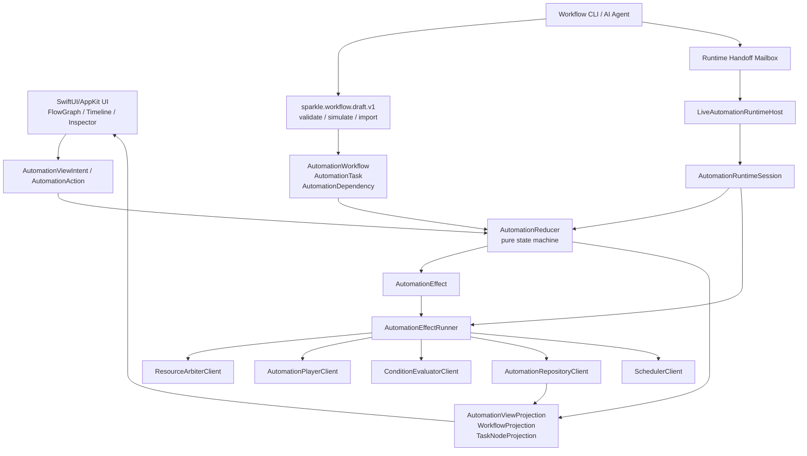

# Current Architecture And Future Snapshot

Updated: 2026-07-06

本文件是本轮长时间并行开发后的暂停快照。它不替代 `automation-engine/` 的底层合同，也不把当前 Workflow 页面描述为完成态。它的用途是让后续 owner、AI agent 和人工审阅者快速理解：现在架构到了哪里，后端逻辑如何流动，文件大致怎么分层，哪些能力已经有 first pass，哪些仍然只是未来设计。

## 1. 当前一句话定位

SparkleRecorder 正从“录制一个宏、播放一个宏”的 macOS 工具，迁移成一个 Pro 级 macOS 原生自动化生产力工具。核心方向已经定下：

- `SavedMacro` 是静态模板。
- `AutomationWorkflow` 是用户编排出的工作流。
- `AutomationTask` 是工作流中的任务节点。
- `AutomationTaskRun` 是每次实际运行的实例。
- Reducer 是状态机中心，所有运行、调度、资源、条件、取消都通过 `AutomationAction` 推进。
- Player、Scheduler、ResourceArbiter、ConditionEvaluator、Repository 都是可 mock 的 client/effect 边界。
- UI 读取 projection，提交 action/intent，不直接调用 Player、scheduler、repository、OCR 或 file IO。
- CLI 是当前 AI 协作接口；MCP 暂缓，未来只能包装同一套 CLI/shared service 语义。

## 2. 当前真实状态

### 已有扎实 first pass

- Swift 6 / Swift Testing baseline 已经建立。
- Recording 已拆出 `RecordingEngineClient`、`RawInputEvent`、`RecordingEventPipeline`、`RecordingSessionProcessor`。
- Playback 已拆出 run lifecycle、live run engine、locator/OCR step client、synchronous CLI engine、failure evidence value model。
- AutomationEngine 核心合同已落在 `AutomationContract.swift`。
- Reducer/state machine 已覆盖 manual start、scheduled start、dependencies、join policy、resource wait、timeout、retry、condition、cancel、panic release、workflow edit persistence。
- ResourceArbiter 已有 foreground input lease、panic release、expired lease cleanup。
- Runtime shell 已有 `AutomationEngineRuntime`、`AutomationRuntimeSession`、`AutomationEffectRunner`、`LiveAutomationRuntimeHost`。
- CLI 已有 macro catalog、draft init/edit/patch/validate/simulate/import/export、workflow list/show/status/run/cancel/runs。
- App-host mailbox handoff 已有 first pass：`workflow run/cancel --handoff app` 投递命令，`workflow handoff status` 查询 pending/dispatched/failed/missing，并在 receipt 带 run IDs 且 repository 有 run history 时返回 run snapshots / workflowStatus。
- Workflow visual condition 已有 core spec、draft schema、live evaluator、visual asset registry、package-root retention。
- Workflow UI 已有很多 first-pass 组件，但仍不能按最终产品验收。
- Pro macOS visual/UX contract 已明确：克制 UI、source bin、拖拽编排、依赖图可读、运行反馈可见。

### 仍不能声称完成

- Workflow 页面整体体验仍不是完成态。拖拽、排序、拉线、条件表达、运行态反馈还需要产品级验收。
- Resource queue 有 waiting/resume/max-wait first pass，仍缺真正的 priority/preemption/cross-process policy。
- Scheduler 只有 reducer tick / runtime timer first pass，仍缺 OS wakeup、login item、daemon/background session。
- Handoff 有 command receipt/status 和 repository-backed result readback；它仍没有 push-style live progress/result stream，也不能唤醒未运行 App。
- Evidence viewer 当前是 per-run-aware first pass，可按 `evidenceID` 读取 macro package per-run manifest/report，显示 binding status、report-derived diagnostic summary，并保留 legacy latest fallback；runtime branch decision evidence first pass 已会把 `AutomationBranchDecisionEvidence` 写到 `AutomationTaskRun.branchEvidence` 并随 run history 持久化，projection/UI 优先读 durable payload，旧 run 回退到 projection；condition diagnostics evidence first pass 已会把 OCR/visual evaluator 的 observed summary、sample count、watched region、score/threshold、diagnostic fields 和 live sample artifact refs 写到 `AutomationTaskRun.conditionEvidence` 并随 run history 持久化，artifact preview/open/reveal 通过安全的 app-edge presenter；visual diagnostics live capture 产品验收仍未完成。
- Managed visual asset storage/migration 仍未完成。
- Recorder 和 Player 虽然已拆很多核心边界，但仍有更多抽 shell、纯引擎、测试边界的空间。

## 3. 架构分层



### Core target

`SparkleRecorderCore` 应该只放纯值类型、reducers、planners、state machines、effect contracts、cache keys、failure evidence builders、mockable clients 和 projection。它不应该 import SwiftUI、AppKit、Vision、ScreenCapture、IOKit，也不应该移动鼠标或发键盘事件。当前 worktree 里 repository / handoff 有 file-backed client first pass；这能支撑 CLI 和测试，但后续仍应审视 live file adapter 是否需要进一步收拢到 app/live 边界。

核心代表文件：

- `AutomationContract.swift`
- `AutomationReducer.swift`
- `AutomationEffectRunner.swift`
- `AutomationEngineRuntime.swift`
- `AutomationRuntimeSession.swift`
- `AutomationResourceArbiter.swift`
- `AutomationSchedulerClient.swift`
- `AutomationRepositoryClient.swift`
- `AutomationRuntimeHandoff.swift`
- `AutomationWorkflowDraft*.swift`
- `AutomationWorkflowProjection.swift`
- `AutomationTaskNodeProjection.swift`
- `AutomationViewProjection.swift`
- `AutomationResourceTimelineItem.swift`
- `PlaybackRunEngine.swift`
- `PlaybackSynchronousRunEngine.swift`
- `RecordingEventPipeline.swift`

### App target

App target 负责 SwiftUI/AppKit UI、CGEvent、CGEventTap、Vision/OCR、ScreenCapture、file picker、share sheet、live provider 和真实 adapter。

代表文件：

- `AutomationMainView.swift`
- `AutomationMainContentView.swift`
- `AutomationFlowGraphView.swift`
- `AutomationResourceTimelineView.swift`
- `AutomationInspectorView.swift`
- `AutomationWorkflowInspectorView.swift`
- `AutomationTaskInspectorView.swift`
- `AutomationWorkflowTaskListView.swift`
- `AutomationMacroTaskLibraryView.swift`
- `AutomationWorkflowDraftPreviewSheet.swift`
- `AutomationWorkflowPackagePresenter.swift`
- `AutomationTaskRunEvidencePresenter.swift`
- `LiveAutomationRuntimeHost.swift`
- `LiveAutomationConditionEvaluatorClient.swift`
- `LiveAutomationPlayerClient.swift`
- `LivePlaybackRunStepClient.swift`
- `EventTapThread.swift`
- `Recorder.swift`
- `Player.swift`
- `main.swift`

### Tests target

测试优先覆盖 pure core 和 fake clients。当前规则仍然是：

- 使用 Swift Testing：`import Testing`, `@Suite`, `@Test`, `#expect`, `#require`。
- 单元测试不移动真实鼠标、不发真实键盘、不调真实 Vision/OCR、不依赖 wall-clock sleep。
- Playback/Recording 先测 pure engine/pipeline，再测 live adapter 边界。
- AutomationEngine 先测 reducer、projection、client/effect handoff。

代表测试：

- `AutomationReducerTests.swift`
- `AutomationContractTests.swift`
- `AutomationOwnerBClientTests.swift`
- `AutomationRuntimeSessionTests.swift`
- `AutomationViewProjectionTests.swift`
- `AutomationWorkflowDraftTests.swift`
- `AutomationWorkflowRuntimeCLITests.swift`
- `PlaybackRunEngineTests.swift`
- `PlaybackSynchronousRunEngineTests.swift`
- `RecordingDragSamplerTests.swift`

## 4. 后端运行逻辑

### 4.1 Workflow 静态模型

`AutomationWorkflow` 保存静态编排：

- `id`
- `name`
- `tasks`
- `dependencies`
- `visualAssets`
- version / timestamps

它不是 run history，也不保存每次执行的结果。

`AutomationTask` 是 workflow 内的静态 task：

- macro task：引用 `SavedMacro.id`
- delay task：等待一段时间
- condition task：OCR/visual/external signal/manual approval 等条件
- notification task：发送通知
- schedule、timeout、retry、resourceRequirement、joinPolicy、graphPosition

`AutomationDependency` 表达 task 之间的边：

- from / to
- trigger：success、failure、timeout、cancelled、condition matched/not matched、always、predicate
- delay
- enabled

### 4.2 运行实例

`AutomationTaskRun` 是真正运行的实例：

- `id` 是 runID
- `executionID` 连接同一条执行链
- workflowID / taskID / macroID
- scheduledStartTime / earliestStartTime / actualStartTime / completedAt
- status：planned、waitingForDependencies、waitingForResource、queued、running、completed
- outcome：success、failed、cancelled、timedOut、resourceConflict、permissionDenied、conditionMatched、conditionNotMatched、missingMacro、rejected
- evidenceID
- leaseID
- attempt
- upstreamRunIDs

同一个 `SavedMacro` 一晚跑三次，就应该生成三个独立 `AutomationTaskRun`，不能污染 `SavedMacro`。

### 4.3 Reducer 状态机

`AutomationReducer` 是后端核心。输入是 `AutomationAction`，输出是新的 `AutomationRunState` 和一组 `AutomationEffect`。

主要 action：

- `clockTick(Date)`
- `manualStart(workflowID:taskID:requestedAt:)`
- `scheduledStartDue(workflowID:taskID:scheduledAt:)`
- workflow/task/dependency edit actions
- `runCreated`
- `resourceLeaseAcquired` / `resourceLeasesAcquired`
- `resourceLeaseDenied`
- `playerStarted`
- `playerFinished`
- `conditionEvaluated`
- `taskFinished`
- `cancelRun`
- `panicRelease`

主要 effect：

- `requestResource`
- `releaseResource`
- `startPlayer`
- `cancelPlayer`
- `evaluateCondition`
- `wait`
- `sendNotification`
- `persistWorkflows`
- `persistRun`

关键规则：

- Reducer 不调用真实 Player。
- Reducer 不调 file IO。
- Reducer 不调 Vision/OCR。
- Reducer 不直接等待真实时间。
- Reducer 只描述下一步需要的 effect。

### 4.4 ResourceArbiter

前台键鼠控制权是核心互斥资源，目前用 `foregroundInput` 表达。资源逻辑当前已做到：

- 一次只能有一个 foreground input lease。
- resource busy 时 run 保持 `waitingForResource`，不是直接失败。
- release/tick/panic release 会刷新等待队列。
- panic release 可清理孤儿 lease。
- lease 可过期清理。
- projection 已能告诉 UI 正在等什么资源，被哪个 active lease blocker 卡住。
- max wait first pass 已能让等待过久的 run 变成 `.timedOut(deadline:)`，并向 UI 投影 deadline/remaining/fraction。

仍缺：

- priority policy
- richer max wait product policy
- starvation protection
- preemption
- cross-process resource coordination
- UI 端资源队列产品表达

### 4.5 Scheduler

当前 scheduler 能力分两层：

- Core 层：`AutomationScheduleOccurrence` 计算 once/repeating 下一次 occurrence。
- Reducer 层：`clockTick` 可创建 due repeating run，且每个 task 每次 tick 最多补一个 due occurrence。

运行时由 `AutomationSchedulerClient` 产生 tick，`AutomationRuntimeSession` 接入 runtime。

仍缺：

- OS 级唤醒
- login item / launch agent
- daemon/background session
- 长时间 App 不运行后的恢复策略
- 多 occurrence timeline preview

### 4.6 Condition

条件不在 UI 或 reducer 里直接执行。Reducer 发出 `evaluateCondition` effect，Owner B client 返回 action。

当前条件方向：

- OCR text
- visual region changed
- image appeared
- image disappeared
- pixel matched
- external signal
- manual approval
- previous outcome/contextual condition

视觉条件已支持 draft visualAssets registry，runtime 可通过 workflow package root 恢复 image/baseline provider。

仍缺：

- 更完整的 live diagnostic evidence
- managed visual asset storage
- moved/deleted file recovery
- 更直觉的用户 authoring flow

### 4.7 Player

Player 正在从“巨型生命周期对象”变成 composition shell：

- Core `PlaybackRunEngine` 负责 live plan loop、progress、conflict、failure evidence construction。
- App `LivePlaybackRunStepClient` 负责 AppKit/OCR/locator/真实 event posting。
- Core `PlaybackSynchronousRunEngine` 负责 CLI blocking loop。
- App `LivePlaybackSynchronousRunStepClient` 负责同步 live step。
- `PlaybackRunStateMachine` 管 lifecycle generation/progress/stale update/terminal mapping。
- `PlaybackEvidenceClient` / `PlaybackFailureEvidence` 收口失败证据。

仍缺：

- Player shell 继续变薄。
- evidence diagnostics / branch drill-in product evidence。
- runtime progress/result stream 和 UI run evidence 更强绑定。

### 4.8 Recording

Recording 已经开始边界拆分：

- `RecordingEngineClient`
- `LiveRecordingEngineClient`
- `RawInputEvent`
- `RecordingEventPipeline`
- `RecordingSessionProcessor`
- `RecordingEventBuffer`

正确方向是：

```text
EventTapThread -> RecordingEngineClient<RawInputEvent> -> RecordingEventPipeline -> RecordedEvent
```

这样 CGEvent 留在边界，pipeline 可纯测试。

仍缺：

- 继续把 `Recorder.swift` 变成 lifecycle shell。
- 高并发 event stream 的更完整性能验证。
- 录制预览轨迹/编辑体验的 UI 侧 polish。

## 5. CLI / AI 接口现状

本阶段只做 CLI-first。AI 应生成 `sparkle.workflow.draft.v1`，不直接写内部 Swift Codable JSON，也不直接写 `.sparkrec_workflow`。

已实现的关键命令：

```bash
SparkleRecorder workflow macros --json
SparkleRecorder workflow draft init --name "..." --out draft.json --json
SparkleRecorder workflow draft task add draft.json --key start --type macro --macro-name "..." --out draft.json --json
SparkleRecorder workflow draft task set ...
SparkleRecorder workflow draft schedule set ...
SparkleRecorder workflow draft condition set ...
SparkleRecorder workflow draft dependency add/set/remove ...
SparkleRecorder workflow draft patch draft.json patch.json --json
SparkleRecorder workflow draft validate draft.json --json
SparkleRecorder workflow draft simulate draft.json --json
SparkleRecorder workflow import draft.json --dry-run --json
SparkleRecorder workflow import draft.json --confirm --json
SparkleRecorder workflow list --json
SparkleRecorder workflow show <workflow-id> --json
SparkleRecorder workflow status [workflow-id] --json
SparkleRecorder workflow export <workflow-id> --format draft-json --json
SparkleRecorder workflow run <workflow-id> --task <task> --confirm --json
SparkleRecorder workflow run <workflow-id> --task <task> --confirm --handoff app --json
SparkleRecorder workflow cancel <run-id> --confirm --json
SparkleRecorder workflow cancel <run-id> --confirm --handoff app --json
SparkleRecorder workflow handoff status <command-id> --json
SparkleRecorder workflow runs <workflow-id> --json
```

AI 协作理想流程：

1. 读取宏库 catalog。
2. 根据用户目标生成 draft。
3. validate。
4. simulate。
5. 必要时 patch/edit。
6. dry-run import。
7. 用户确认后 confirm import。
8. 用户显式确认后 run 或 handoff app。
9. 用 status/runs/handoff status 查询结果。

## 6. Workflow UI 现状

当前 Workflow UI 有大量 first-pass 文件，但仍不能视为最终可用产品。设计基调已经明确：

- Pro macOS 原生生产力工具。
- UI 克制，让自动化数据成为主视觉。
- Macro Library 是 source bin，不是一堆 Web CTA 卡片。
- 中心 graph/list 是主操作区。
- Inspector 是精修，不是唯一配置入口。
- 依赖线、then/else/timeout、join policy、resource wait、runtime feedback 必须在中心区域可读。
- 运行态要在 graph/timeline/inspector 同步反馈。

当前主要 UI 文件分组：

### 页面和布局

- `AutomationMainView.swift`
- `AutomationMainContentView.swift`
- `AutomationOverviewHeader.swift`
- `AutomationWorkflowListView.swift`
- `AutomationWorkflowRow.swift`
- `AutomationInspectorView.swift`

### FlowGraph

- `AutomationFlowGraphView.swift`
- `AutomationFlowGraphNodeView.swift`
- `AutomationFlowGraphEdgeCanvas.swift`
- `AutomationFlowGraphEdgeListView.swift`
- `AutomationFlowGraphConnectorHandle.swift`
- `AutomationFlowGraphLinkPreview.swift`
- `AutomationFlowGraphLinkingToolbar.swift`
- `AutomationFlowGraphBranchGuideView.swift`
- `AutomationFlowGraphEdgeLabelView.swift`

### Task list / drag reorder

- `AutomationWorkflowTaskListView.swift`
- `AutomationWorkflowTaskListPreviewState.swift`
- `AutomationWorkflowTaskRowView.swift`
- `AutomationWorkflowTaskInsertionDropTarget.swift`
- `AutomationWorkflowTaskMoveDirection.swift`
- `AutomationTaskDragPayload.swift`
- `AutomationMacroDragPayload.swift`

### Timeline / runtime feedback

- `AutomationResourceTimelineView.swift`
- `AutomationResourceTimelineItem.swift`
- `AutomationTimelineItemView.swift`
- `AutomationRuntimeDetailStrip.swift`
- `AutomationRuntimeStatusHairline.swift`
- `AutomationTimelineSchedulePreview.swift`

### Inspector / authoring

- `AutomationWorkflowInspectorView.swift`
- `AutomationTaskInspectorView.swift`
- `AutomationDependencyInspectorView.swift`
- `AutomationTaskDependencyAuthoringView.swift`
- `AutomationTaskJoinPolicyEditorView.swift`
- `AutomationTaskPositionControlView.swift`
- `AutomationTaskRunControlView.swift`
- `AutomationTaskRunBranchContextView.swift`
- `AutomationTaskBranchPanelView.swift`
- `AutomationTaskBranchDecisionSummaryView.swift`
- `AutomationOCRRegionEditorView.swift`
- `AutomationVisualConditionEditorView.swift`

### AI Draft Preview

- `AutomationWorkflowDraftPreviewSheet.swift`
- `AutomationWorkflowDraftPreviewPresenter.swift`
- `AutomationWorkflowDraftPreviewProjection.swift`
- `AutomationWorkflowDraftPreviewState.swift`
- `AutomationWorkflowDraftConditionEditorView.swift`
- `AutomationWorkflowDraftScheduleEditorView.swift`
- `AutomationWorkflowDraftDependencyEditorView.swift`
- `AutomationWorkflowDraftPatchSectionView.swift`
- `AutomationWorkflowDraftVisualAssetEditorView.swift`
- `AutomationWorkflowDraftVisualAssetActionButtonsView.swift`

### Evidence

- `AutomationTaskRunDetailView.swift`
- `AutomationTaskRunEvidencePresenter.swift`
- `AutomationTaskRunEvidencePayload.swift`
- `AutomationTaskRunEvidenceBindingView.swift`
- `AutomationTaskRunEvidenceDiagnosticsView.swift`
- `AutomationTaskRunEvidenceSectionView.swift`
- `AutomationTaskRunEvidenceScreenshotPreviewView.swift`

## 7. 文件结构总览

当前工程没有 Xcode project 作为源头，`Package.swift` 是 source of truth。

```text
Sources/SparkleRecorder/
  Automation*.swift              Workflow / AutomationEngine / UI / CLI shared files
  LiveAutomation*.swift          App-target live adapters
  LivePlayback*.swift            App-target playback live step clients
  Playback*.swift                Playback engines, state machines, planners
  Recording*.swift               Recording pipeline, buffer, session processing
  Recorder.swift                 Recording lifecycle shell
  Player.swift                   Playback lifecycle shell
  main.swift                     App entry + workflow CLI
  EventTapThread.swift           CGEvent tap boundary
  ScreenCaptureService.swift     Screen capture app edge
  VisionDetector.swift           OCR/Vision app edge
  MacroRepository*.swift         Macro persistence/app repository

Tests/SparkleRecorderTests/
  Automation*Tests.swift         Reducer/client/projection/draft/runtime CLI tests
  Playback*Tests.swift           Playback engines/planners
  Recording*Tests.swift          Recording pipeline/sampler
  TimelineProjectionTests.swift  Timeline projections

docs/
  DOCUMENTATION_STATUS.md        Active doc index
  automation-engine/             Core engine contracts and three-owner history
  workflow-page-productization/  Current productization plan and UI/CLI contracts
```

Important: 当前 worktree 有大量 modified / untracked 文件，这是并行开发状态。不要用 `git reset` 或 checkout 回滚别人改动。

## 8. 当前后端能力矩阵

| Area | Current State | Future Work |
| --- | --- | --- |
| Core workflow model | First pass solid | schema evolution and migration policy |
| Reducer | First pass strong | deeper resource priority, preemption, and starvation policy |
| ResourceArbiter | foregroundInput lease, panic release | cross-process arbitration, preemption, starvation prevention |
| Scheduler | tick + due occurrence generation | OS wakeup, login item, daemon/background runtime |
| Runtime host | session + effect runner + app lifecycle | health projection, daemon bridge, live result stream |
| Handoff | file mailbox + receipt/status/result readback | XPC/daemon, push-style progress stream, wake non-running app |
| CLI/AI | broad draft/import/runtime first pass | sample packs, stricter schema docs, future MCP wrapper |
| Visual conditions | core/draft/live evaluator first pass | managed storage, diagnostics, visual evidence |
| Evidence | per-run-aware macro package evidence first pass, binding status, report-derived diagnostic summary, inline failure screenshot preview, preview-unavailable fallback, Reveal/Open file action feedback in Run Detail, durable branch decision evidence on `AutomationTaskRun.branchEvidence`, durable condition diagnostics on `AutomationTaskRun.conditionEvidence`, live last-sample/watched-region artifact refs, safe artifact presenter preview/open/reveal boundary with artifact action feedback, failed-run/preview-unavailable/branch/visual diagnostics/task-reorder fixture screenshots, branch decision edge projection fallback, plus legacy latest fallback | live visual diagnostics recording, real drag/reorder recording, Open/Reveal interaction recording, template/baseline preview artifact polish |
| UI projection | many ready fields | product validation and performance profiling |
| Workflow UI | many components first pass | actual WYSIWYG polish, screenshots/recordings acceptance |

## 9. 下一阶段建议顺序

### Step 1: 停止扩散，稳定当前工作树

先不要继续加横向能力。当前已有足够多 first pass，下一步应先让并行改动能被 review：

- 跑 `swift build -Xswiftc -swift-version -Xswiftc 6`
- 跑 targeted tests
- 跑 `git diff --check`
- 对文档和代码做一次“哪些是本轮新增、哪些是并行已有”的分组
- 决定是否拆 commit 或拆 PR

### Step 2: Workflow UI 产品验收

UI owner 应按 `06-workflow-visual-ux-contract.md` 做真实验收：

- idle screenshot
- drag macro to graph/list
- existing task reorder fixture evidence and graph-position follow-up
- connector drag link
- selected condition branch readability
- running/waiting/failed runtime state
- evidence detail

重点不是“控件都在”，而是用户是否能凭直觉完成自动化编排。

### Step 3: Resource queue policy

Owner 1 下一个纯后端切片可以是 resource queue policy：

- priority ordering
- richer max-wait product policy beyond the current first pass
- wait timeout outcome polish
- starvation protection
- projection 文案
- reducer tests

这能直接解决多个 workflow 抢鼠标键盘的问题。

### Step 4: Evidence diagnostics and acceptance

当前 per-run-aware evidence viewer 已能读取 macro package 的 per-run manifest/report，显示 binding status 和 report-derived diagnostic summary，但可信排查还需要：

- evidence payload 包含 OCR/visual match diagnostics、target window metadata、locator/cache info。
- runtime branch decision durable payload 已有 first pass；下一步是用产品截图/录屏证明 Run Detail branch evidence 和 FlowGraph edge state 一致。
- CLI status/runs 可返回可审阅 evidence metadata。
- UI 产品截图已证明 failed run detail、screenshot preview、preview unavailable fallback、macro evidence Reveal/Open action feedback 和 visual artifact Reveal/Open action feedback 可读；Open/Reveal 真实交互录屏仍需单独 artifact。
- 测试不依赖真实截图。

### Step 5: Daemon/background runtime

这是大工程，不建议在当前 dirty worktree 里硬上。设计要先定：

- App host vs background helper vs launch agent
- mailbox 是否升级为 XPC
- foreground input lease 是否跨进程
- App 未运行时如何唤醒
- 用户如何看到 runtime health
- CLI 如何拿 progress/result stream

### Step 6: Managed visual assets

视觉条件要产品化，需要把 draft package asset 和 internal workflow asset 的关系稳定下来：

- import 时 copy 还是 retain root
- moved/deleted files 怎么提示
- baseline/image hash 怎么校验
- UI 怎么展示 missing state
- export 如何保持 round-trip

## 10. 未来产品畅想

最终 SparkleRecorder 可以成为一个原生 macOS RPA 编排台：

- 用户录制简单宏，像素材一样放进 Macro Library。
- 用户把宏拖到 Workflow canvas，形成任务节点。
- 用户用连线表达顺序、成功、失败、超时、条件分支。
- 用户把“等待文本”“等待图标出现”“等待区域变化”“等待像素颜色”当作自然语言条件使用。
- 系统自动管理前台键鼠控制权，避免多个宏抢鼠标。
- 运行时 graph 会活起来：哪个节点在跑、哪个资源在等、哪条边刚触发、哪个条件正在轮询。
- AI 可以读取宏库，生成 draft workflow，validate/simulate/import，全程可审阅。
- CLI 是 AI 的稳定底座；MCP 未来只是同一套能力的工具包装。
- Evidence 是每次 run 的事实记录，用户和 AI 都能用它定位失败。

真正理想的体验不是“用户配置很多表单”，而是：

```text
录制几个可靠小宏 -> 拖成流程 -> 加条件/超时分支 -> 模拟 -> 运行 -> 看它自己跑 -> 失败时有证据可查
```

## 11. 暂停结论

当前迁移方向是对的，底层架构已经从单宏播放器逐步转向可测试的 AutomationEngine。最重要的合同都已经成型：静态 workflow、运行实例、reducer/effect、resource lease、runtime session、CLI draft/import/runtime、projection-driven UI。

现在不应该继续无限加 first pass。下一阶段更重要的是收敛：

- 让 Workflow UI 真正可用。
- 让 resource queue 策略完整。
- 让 evidence 从 per-run report 过渡到可诊断、可验收的失败证据。
- 让 daemon/background runtime 有清晰合同再开发。
- 让文档从“规划很多”变成“验收证据清楚”。
